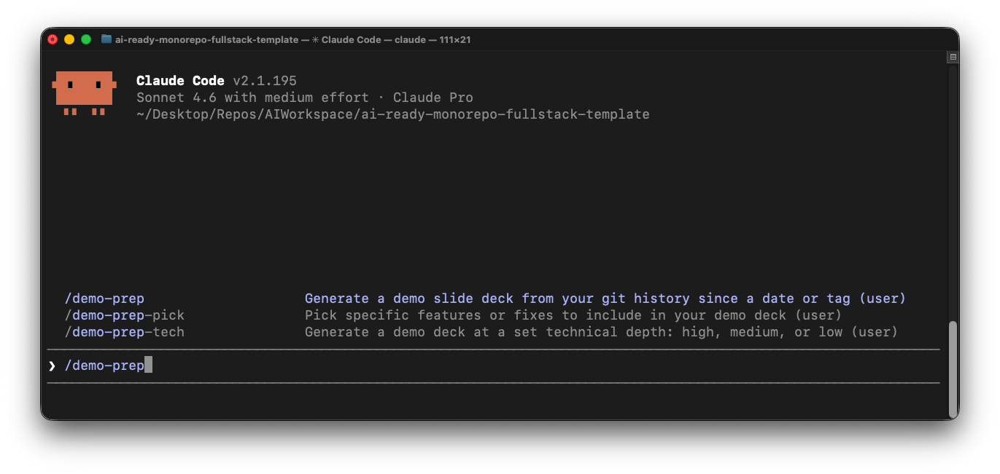
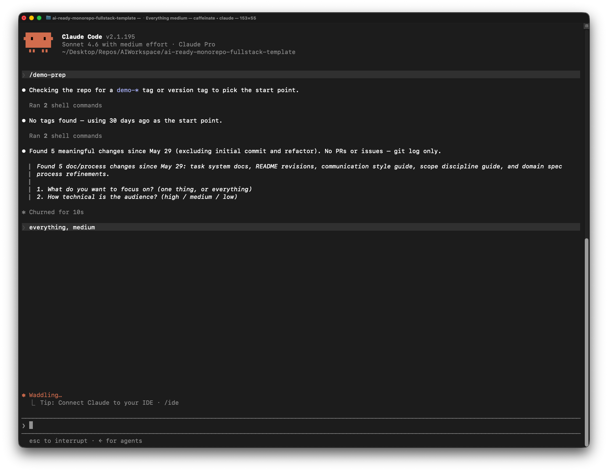
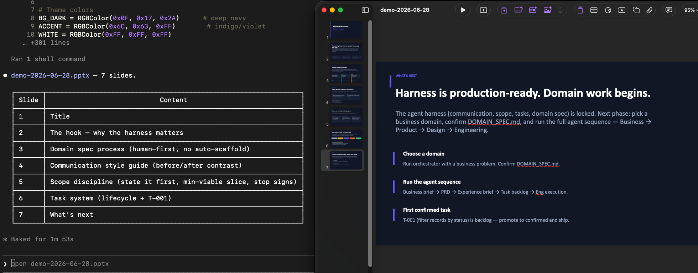
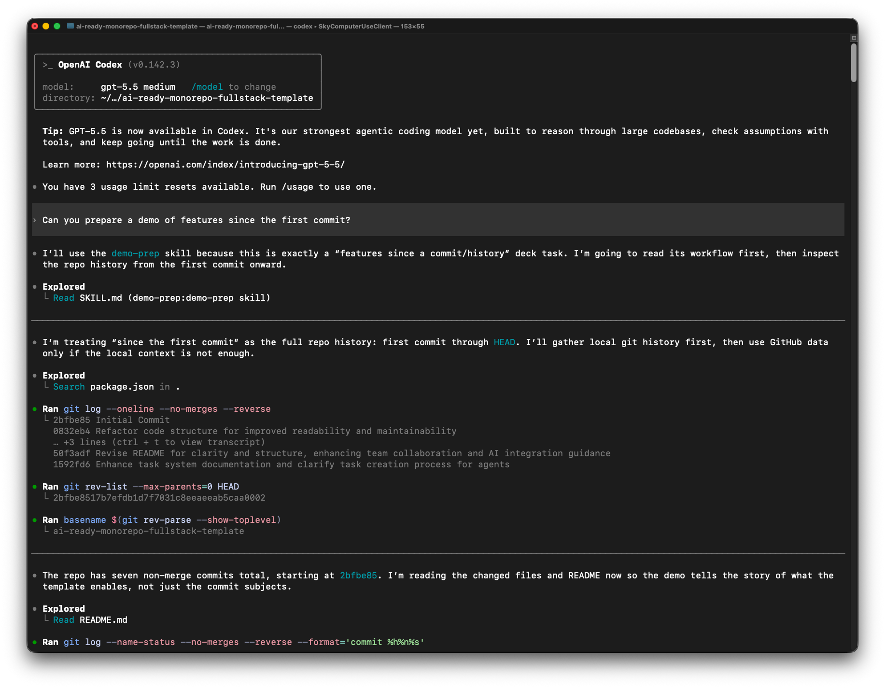
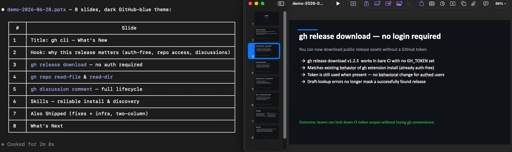
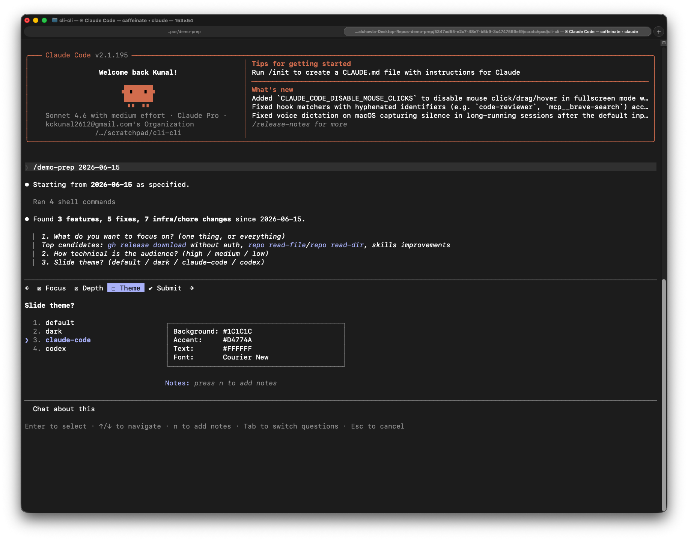
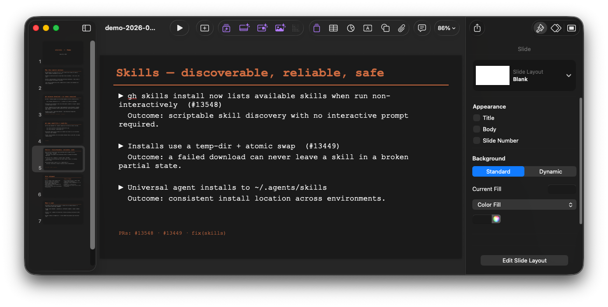

# demo-prep 🎬

**Turn your git history into a polished slide deck — in under two minutes.**

Engineers ship fast. Demo prep shouldn't slow them down. `demo-prep` is a Claude Code and Codex plugin that reads your commits, PRs, and issues since your last demo and generates a ready-to-present `.pptx` — tailored to your audience, focused on what matters.

---

## ✨ See it in action

**Type `/demo-prep` and the skill appears instantly:**



**It asks a few questions, then gets to work:**



**A polished deck, ready in your project directory:**



**Works in Codex too — just ask it to prep a demo:**



---

## 🚀 Real-world example: GitHub CLI

We ran `demo-prep` against [`cli/cli`](https://github.com/cli/cli) — one of GitHub's own most active repos — covering everything shipped in June 2026.

```
/demo-prep 2026-06-01
```

**8 slides. 2 minutes. ⚡**



One command. No deck template to fill in. No time spent deciding what to cut.

---

## 📦 Install

### Claude Code plugin

```text
/plugin marketplace add kckunal2612/demo-prep
/plugin install demo-prep@demo-prep
```

Or install standalone commands directly into `~/.claude/commands/` (gives you unnamespaced `/demo-prep`):

```bash
curl -fsSL https://raw.githubusercontent.com/kckunal2612/demo-prep/main/install.sh | bash
```

For a local checkout:

```bash
./install.sh
```

> **Plugin vs standalone:** The plugin namespaces commands as `/demo-prep:demo-prep`. The standalone install gives you the shorter `/demo-prep`.

### Codex plugin

```bash
codex plugin marketplace add kckunal2612/demo-prep
codex plugin add demo-prep@demo-prep
```

Or open `/plugins` in Codex, select the Demo Prep marketplace, and install `demo-prep`. Then ask Codex to prep a demo, or invoke `@demo-prep` directly.

---

## 🎯 Commands

| Command | What it does |
|---|---|
| `/demo-prep` | Full interactive flow — asks what to focus on, audience, and theme |
| `/demo-prep 2026-05-01` | Same, but starting from a specific date or git tag |
| `/demo-prep-tech high` | Skip the audience question, set technical depth directly (`high` / `medium` / `low`) |
| `/demo-prep-pick` | Shows everything shipped as a numbered list — you pick what goes in the deck |

> With the plugin, prefix commands with `demo-prep:` (e.g. `/demo-prep:demo-prep`).

---

## 🎨 Themes

Pick a theme when prompted — or just hit enter for the default.

| Theme | Vibe |
|---|---|
| `default` | Clean white, blue accents |
| `dark` | Deep navy, indigo/violet accents |
| `claude-code` | Near-black, Claude orange accents, monospace body font |
| `codex` | Charcoal, OpenAI green accents |

`claude-code` and `codex` are purpose-built for AI tool demos and internal eng reviews. They look sharp on dark-mode monitors and match the aesthetic your audience is already used to.





---

## ⚙️ How it works

1. 🔍 **Finds the start point** — last `demo-*` tag → last version tag → 30 days ago. Shows you what it picked so you can override.
2. 📖 **Reads your history** — commits, merged PRs, closed issues since that point.
3. ❓ **Asks three questions** — what to focus on, how technical the audience is, and which theme to use.
4. ✍️ **Writes the deck** — language, framing, slide structure, and colors adapt to your choices.
5. 💾 **Saves `demo-YYYY-MM-DD.pptx`** to your project directory, ready to open in Keynote or PowerPoint.

---

## 🛠 Requirements

- [Claude Code](https://claude.ai/code) and/or [Codex CLI](https://github.com/openai/codex)
- `git`
- `gh` CLI *(optional — enables PR and issue details)*

---

## 🔌 For plugin authors

Claude Code uses the plugin manifest version when deciding whether an installed plugin needs an update. Bump `version` in `.claude-plugin/plugin.json` with each release.

## License

MIT © Kunal Chawla
